# NVM (Node Version Manager)

El objetivo de este fichero es mostrar la utilidad de nvm así como resumir los comandos que yo personalmente he utilizado.

## ¿Qué es NVM?
nvm es un gestor de versiones de nodejs. Te permite tener instaladas distintas versiones de node en tu equipo, además te permite cambiar entre ellas en cualquier momento.

## Instalación 
**Importante**: nvm solo está disponible para linux y mac (según su repositorio oficial). Existen alternativas para windows pero no de los mismos creadores.  
**Update 27/04/21**: lo he probado y nvm funciona en WSL2. Para instalarlo es seguir los mismos pasos que en linux/mac. 
  
Para instalar nvm puedes seguir los pasos del [repositorio oficial](https://github.com/nvm-sh/nvm). La última versión a fecha de 11-02-2021 es la `0.37.2`.

El resumen en español de la instalación es el siguiente:
- Ejecutar el siguiente comando en la terminal: `curl -o- https://raw.githubusercontent.com/nvm-sh/nvm/v0.37.2/install.sh | bash`.
- Si no se desea ejecutar con curl existe la versión con wget: `wget -qO- https://raw.githubusercontent.com/nvm-sh/nvm/v0.37.2/install.sh | bash`.
  
<div align="center">  

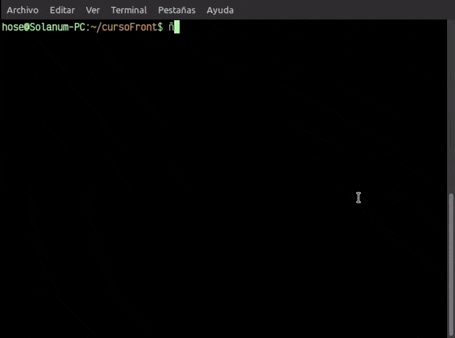

</div>

Una vez ejecutado uno de esos dos comandos, debería haberse instalado nvm correctamente. Para finalizar con la instalación, comprobar que en nuestro fichero `.bashrc` o `.zshrc` se encuentran estas líneas:    

```
export NVM_DIR="$HOME/.nvm"
[ -s "$NVM_DIR/nvm.sh" ] && \. "$NVM_DIR/nvm.sh"  # This loads nvm
[ -s "$NVM_DIR/bash_completion" ] && \. "$NVM_DIR/bash_completion"  # This loads nvm bash_completion
```
<div align="center">

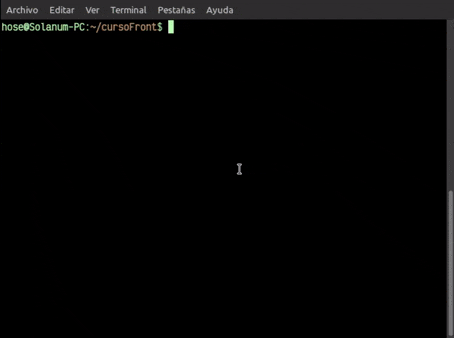  

</div>

Si estas líneas no aparecen en dichos ficheros, ejecutamos:

`export NVM_DIR="$([ -z "${XDG_CONFIG_HOME-}" ] && printf %s "${HOME}/.nvm" || printf %s "${XDG_CONFIG_HOME}/nvm")"
[ -s "$NVM_DIR/nvm.sh" ] && \. "$NVM_DIR/nvm.sh" # This loads nvm`


Y recargamos los ficheros de configuración de nuestra shell ejecutando `source .bashrc` o `source .zshrc`. (O también podemos cerrar y abrir de nuevo la terminal).  

Finalmente, si todo ha ido bien, comprobamos que nvm está correctamente instalado ejecutando `nvm --version`.

<div align="center">

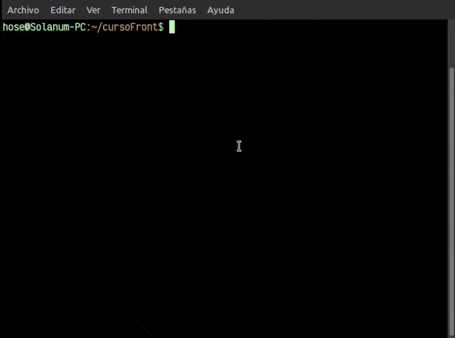

</div>

Lo bueno de nvm es que crea un directorio oculto en tu `/home`, evitandote así hacer todos los pasos del `npm config set prefix` y evitamos problemas con `sudo` y el directorio `/usr`.  

Cuando instalemos nvm se nos creará un directorio oculto `/home/<username>/.nvm` en el cual se hallarán todas las cosas necesarias para su funcionamiento. Cuando instalemos node, sus distintas versiones se instalarán en `home/<username>/.nvm/versions/node/`. 

## Uso
Una vez instalado, podemos instalar node de la siguiente manera:  

### Última versión de node
Si queremos instalar la última versión disponible de node ejecutamos `nvm install node`.  

<div align="center">

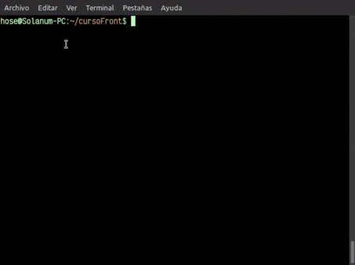

</div>

**Nota**: a día de hoy 11-02-2021, la última versión de node es la 15.8.0.  

### Última versión LTS (Long Term Support)
Para instalar la última versión [lts](https://es.wikipedia.org/wiki/Soporte_de_largo_plazo), ejecutamos el comando `nvm install --lts`.  

<div align="center">

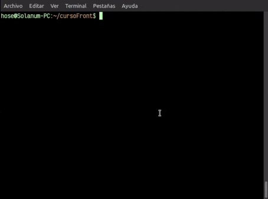

</div>

### Una versión específica de node
Si queremos instalar una versión específica de node, ejecutamos `nvm install X.X.X` donde X son los números de la versión. Por ejemplo, en clase teníamos que instalar la versión 14.15.5, para ello ejecutariamos `nvm i 14.15.5`  (i es la versión corta de install, para no estar escribiendo tanto).  

<div align="center">

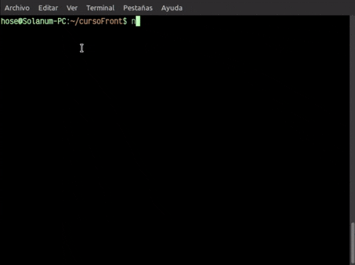

</div>

Si ejecutamos, por ejemplo, `nvm i 13` o cualquier número de versión, instalará la última versión disponible de dicho major.  

<div align="center">

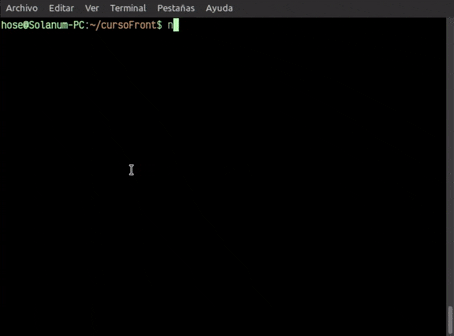 

</div>

**Nota**: por lo general cuando instalamos una versión de node, esta se pone como la versión a utilizar pero no preocuparse que podemos cambiar eso. 

### Desinstalar una versión
Para desinstalar una versión de node ejecutamos el comando `nvm uninstall <version de node>`. Por ejemplo, para desinstalar la versión 14.15.5 sería `nvm unistall 14.15.5`. Si de un major, solo tenemos instalada una versión (Ej de node 13 tenemos solo 13.14.0), también vale `nvm uninstall 13`)

<div align="center">

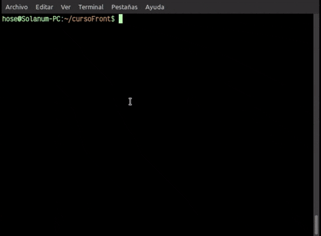

</div>

### Listar versiones instaladas
Para listar las versiones instaladas en nuestro equipo, ejecutamos el comando `nvm list` o `nvm ls`.

<div align="center">

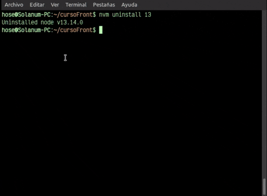 

</div>

### Listar todas las versiones disponibles
Para ver todas las versiones de node disponibles en nvm, se utiliza el comando `nvm ls-remote`.  

<div align="center">

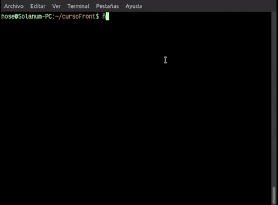

</div>

### Seleccionar la versión a utilizar
Para establecer la versión de node a utilizar, ejecutamos `nvm use <version de node>`.  

<div align="center">

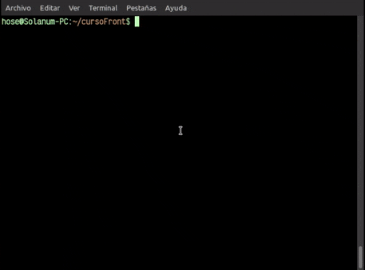

</div>

**Nota**: con este comando establecemos la versión de node a utilizar en nuestra sesión actual. Si cerrásemos la terminal y la volvieramos a abrir, ejecutaríamos la versión de node que tenemos establecida por defecto.

Si en algún momento quisieramos ver qué versión estamos ejecutando es `nvm current`.

<div align="center">

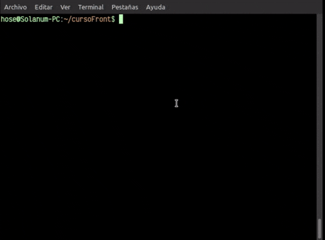

</div>

### Establecer una versión por defecto
Si queremos establecer la versión por defecto que queremos utilizar cada vez que ejecutemos node, se hace con el comando `nvm alias default <version de  node>`.  


<div align="center">

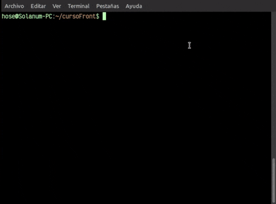

</div>

### Instalar npm
nvm nos instala npm cuando instalamos cualquier versión de node, pero dependiendo de la versión que instalemos instalará una versión de npm distinta. Si queremos utilizar la última versión de npm en la versión de node de nuestra elección, se hace ejecutando el comando `nvm install-latest-npm`.  

<div align="center">

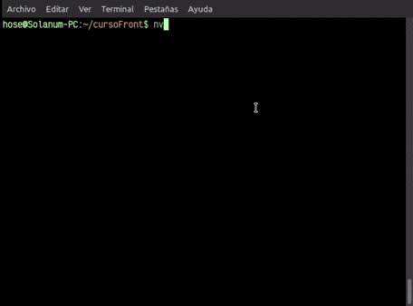

</div>

**Nota**: Se instalará la última versión de npm para el node que actualmente tengamos establecido con `nvm use`. Por ejemplo, en el curso hemos instalado node 14 el cual tiene node 6. Si queremos actualizar a npm 7 con dicha versión de node, sería con `nvm use node 14.15.5` y `npm install-latest-npm`.   

### Establecer un alias
Para ahorrarnos escribir todo el rato la versión de node en semantic versioning que querramos utilizar, podemos crear un alias. Para ello ejecutamos `nvm alias <nombre> <version de node>`.

Para deshacerlo es con `nvm unalias <bombre>`.

<div align="center">

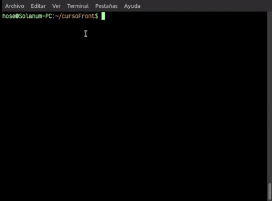

</div>

Para una versión detallada de estos comandos y del resto de comandos ejecutar `nvm --help` para ver la ayuda de los propios creadores.
